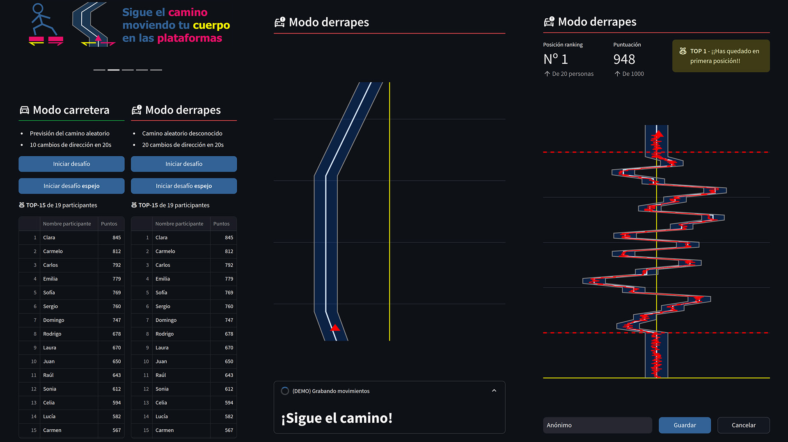
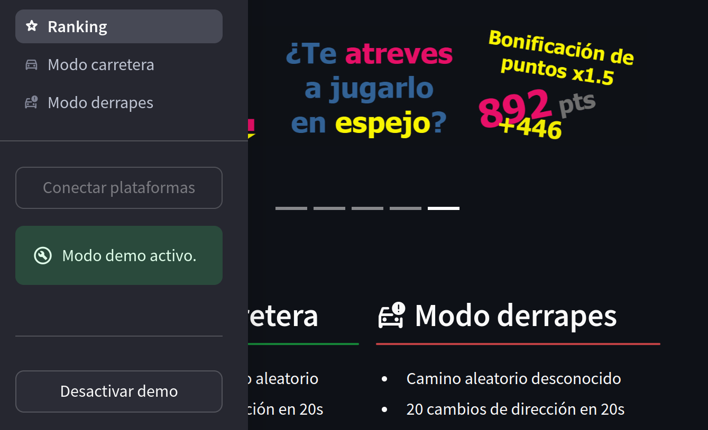

# Información del proyecto

Se trata de una aplicación interactiva con plataformas de fuerza para la Noche Europea de los Investigadores.

El objetivo con este proyecto es exponer el trabajo realizado con las plataformas de fuerza en mi Trabajo Fin de Máster, mostrando una versión simplificada e interactiva del [software `force_platform_reader`](https://github.com/AaronPB/force_platform) desarrollado.

<p align="center">
  <a href="https://lanochedelosinvestigadores.fundaciondescubre.es/" target="_blank"></a>
  <br>
  <br>
  <a href="https://github.com/AaronPB/force_platform"></a>
</p>

La aplicación consiste en un desafío en el que se debe seguir un camino 2D generado de manera aleatoria, estando de pie sobre dos plataformas de fuerza.

La persona tendrá que mantener un puntero dentro del camino mostrado, inclinando su peso hacia la derecha o izquierda para moverlo. Al final del trayecto, se indica una puntuación según la desviación con respecto a la ruta generada y se clasifica en la tabla correspondiente del desafío.



## Modos de dificultad

Se han planteado dos modos de dificultad, para animar a los que tienen mayor capacidad de reacción:
- **Modo carretera**: este sería el modo normal. Se muestra al participante el camino previo y contiene 10 cambios de dirección en 20 segundos.
- **Modo derrapes**: En este modo no se muestra el camino al participante y contiene 20 cambios de dirección en 20 segundos.

En estos modos existe además la posibilidad de invertir los controles, haciéndolo aún más desafiante. Si se hace el desafío con esta opción, se aplica un multiplicador a la puntuación final como recompensa.

## Modo DEMO

Se incluye un modo DEMO que se puede activar desde la barra lateral de la aplicación, para comprobar su funcionamiento sin conectar las plataformas de fuerza.



Este modo simula los ratios de voltaje obtenidos por los sensores de la plataforma, a partir de la ruta aleatoria generada, a la que se aplica un cierto ruido para que no sea perfecto.

# Instalación

> [!WARNING]
> Para utilizarlo se requieren dos plataformas de fuerza verticales con sensores compatibles con PhidgetBridge. En caso contrario, debe modificar el [driver](src/handlers/drivers/phidgetLoadCell.py) para utilizar la API de los sensores que utilicen sus plataformas.

A continuación se muestran tres maneras de instalar la aplicación y hacerlo funcionar con [streamlit](https://streamlit.io/) de manera local en la ruta:

```
http://localhost:8501/
```

## Utilizando Docker

Instala [Docker](https://www.docker.com/products/docker-desktop/) con lo necesario para que funcione en el OS.

Crea una carpeta y copia el contenido del archivo [Dockerfile](Dockerfile) de este repositorio en un archivo `Dockerfile` creado en esa carpeta.

Construye la imagen a partir del archivo `Dockerfile` creado.

```bash
cd carpeta_con_dockerfile
docker build -tag nei-force-platform-ranking .
```

Arranca un contenedor con las rutas USB compartidas, para poder acceder a las plataformas conectadas.

> [!IMPORTANT]
> El indicador `--privileged` da permisos totales al contenedor, para evitar problemas a la hora de reconectar sensores.
>
> Si por seguridad prefieres evitarlo, debes indicar todas las rutas a cada sensor de manera manual, agregando los volúmenes correspondientes con `-v`. Ten en cuenta que se puede perder la comunicación al desconectar USBs, debiendo reiniciar el contenedor. Asegúrate de tener conectados los sensores antes de iniciar el contenedor.

```bash
docker run --name nei-fp-app -p 8501:8501 --privileged nei-force-platform-ranking
```

Una vez arrancado el contenedor, se puede parar y volver a iniciar con los siguientes comandos:

```bash
docker <start|stop> nei-fp-app
```

## Utilizando un contenedor de desarrollo Docker con VSCode

Si ya trabajas con [contenedores de desarrollo Docker con VSCode](https://code.visualstudio.com/docs/devcontainers/containers), en este repositorio se incluye una carpeta `.devcontainer` con lo necesario para que funcione.

Descarga el repositorio en la ubicación deseada:

```bash
git clone git@github.com:AaronPB/nei-force-platform-ranking.git
```

Y abre el proyecto en VSCode para que identifique la carpeta `.devcontainer` y construya todo lo necesario.

Una vez abierto el contenedor de desarrollo, iniciar la aplicación con streamlit:

```bash
streamlit run app.py
```

## Instalando localmente

Descarga el repositorio en la ubicación deseada:

```bash
git clone git@github.com:AaronPB/nei-force-platform-ranking.git
```

Descarga la dependencia Phidget22 para leer los sensores desde los PhidgetBridge.

Para [Linux](https://www.phidgets.com/docs/OS_-_Linux#Quick_Downloads):

```bash
curl -fsSL https://www.phidgets.com/downloads/setup_linux | sudo -E bash - &&\
sudo apt-get install -y libphidget22
```

> Para [Windows](https://www.phidgets.com/docs/OS_-_Windows#Quick_Downloads) o [MacOS](https://www.phidgets.com/docs/OS_-_macOS#Quick_Downloads)

Posteriormente, descarga los [requisitos](requirements.txt) necesarios vía `pip`.

> [!TIP]
> Este proyecto se ha desarrollado con Python `3.10.12`.

```bash
pip install -r requirements.txt
```

Por último, inicia la aplicación con streamlit:

```bash
streamlit run app.py
```
